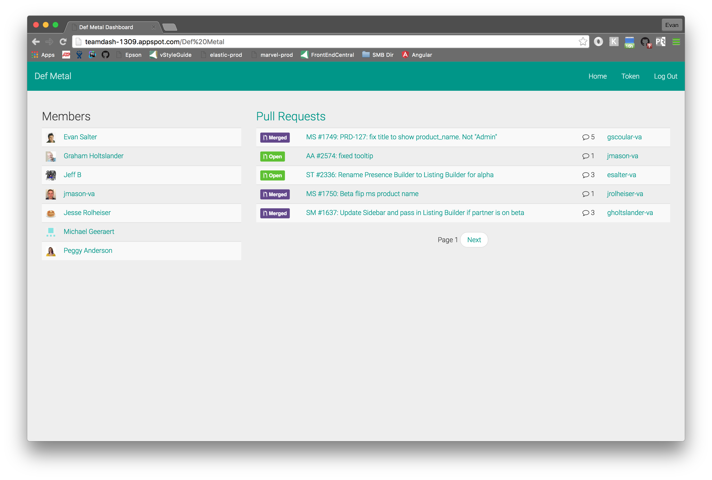
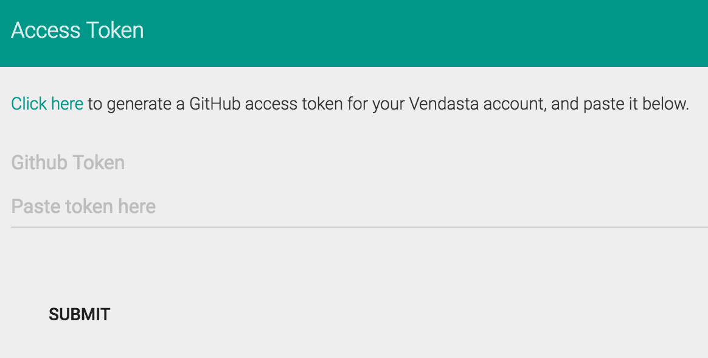

# TeamDash

TeamDash provides a simple way to check the status of your team(s) at Vendasta.
Currently, it lists the members and recent pull requests of a given GitHub team.

## Features

- Choose any [GitHub team at Vendasta](https://github.com/orgs/vendasta/teams)
- Google Authentication
- Direct links to recent PRs

## Sort of working

- PR pagination is somewhat janky, but works well enough

## Usage

The app is currently hosted at [http://teamdash-1309.appspot.com/](http://teamdash-1309.appspot.com/)

When you go to the page, you will need to sign in with your Vendasta Google account.

The first time you log in, you will need to create a GitHub personal access token to allow
the app to access the required org/team/repo/pr information.  To create your token, click the
"Click here" link at the top of the page (shown below), and choose "Generate Token".
Then, copy and page the token into "Paste token here" box, and submit.

You will then be taken to a team selection page.  Choose your team from the dropdown
and click submit.

The PR list will refresh every 60 seconds.